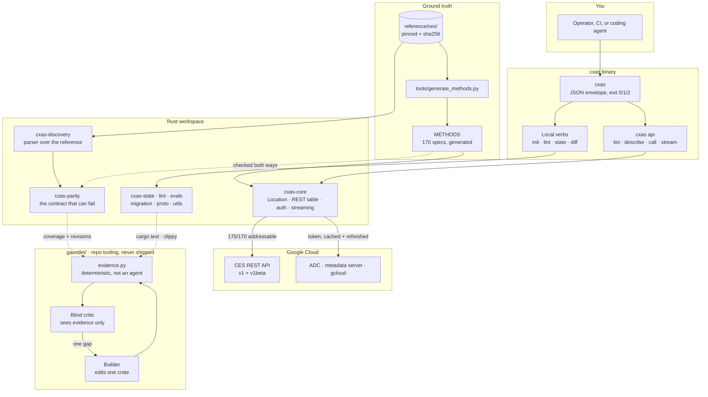

# cxas-harness

[](https://yash-kavaiya.github.io/cxas-harness/)
[](https://github.com/Yash-Kavaiya/cxas-harness)

Rust rewrite of Google Cloud's [`cxas-scrapi`](https://github.com/GoogleCloudPlatform/cxas-scrapi) — a CLI and library harness for CX Agent Studio (CES).

**Full documentation: <https://yash-kavaiya.github.io/cxas-harness/>**

```sh
cargo test --workspace
cargo run -p cxas-cli -- --help
```

## What it is

A machine-first `cxas` binary — JSON by default, `--no-input` on, stable exit codes — over ten workspace crates.

All **170 methods** CES declares are addressable, from a table generated out of Google's own discovery documents; **37** are additionally modelled with this workspace's own types and CLI verbs. The two numbers are reported separately, because generating 170 path templates is cheap and deciding what a `Deployment` is, and what happens when promoting one fails, is not.

Location is never defaulted to `"global"`. Every CES path template embeds `projects/*/locations/*`, so a resource name cannot be built without one.

| | Where |
|---|---|
| Every CLI command | [cli.html](https://yash-kavaiya.github.io/cxas-harness/cli.html) |
| Crate-by-crate SDK | [crates.html](https://yash-kavaiya.github.io/cxas-harness/crates.html) |
| Architecture and data flow | [architecture.html](https://yash-kavaiya.github.io/cxas-harness/architecture.html) |
| Benchmark and Gauntlet Loop | [benchmark.html](https://yash-kavaiya.github.io/cxas-harness/benchmark.html) |
| **What this does *not* do** | [limits.html](https://yash-kavaiya.github.io/cxas-harness/limits.html) |

## How it fits together



The arrow that matters is `reference/ces/` into everything else. Nothing in this
workspace decides what CES is; it reads that from Google's own machine-readable
description, and `cxas-parity` fails the build when a claim and the reference
disagree.

## Install

| Need | Version | Used for |
|---|---|---|
| Rust | 1.80+ | everything |
| Git | any | cloning |
| Python | 3.11+ | reference refresh, method-table generation, the Gauntlet Loop |
| `protoc` | optional | without it `cxas-proto` uses the hand-written `EvaluationRunState` wrapper, which is the public API either way |

Python 3.11 specifically, not 3.10 — the tooling reads TOML with the standard-library
`tomllib`, which landed in 3.11.

There is no published crate or release binary yet ([limits.html](https://yash-kavaiya.github.io/cxas-harness/limits.html) lists packaging among the things this checkout does not do), so install means build from source.

```sh
git clone https://github.com/Yash-Kavaiya/cxas-harness.git
cd cxas-harness

cargo build --release -p cxas-cli
./target/release/cxas --help
```

Put it on your `PATH`:

```sh
# Linux / macOS
sudo install -m 755 target/release/cxas /usr/local/bin/cxas
```

```powershell
# Windows PowerShell
$dest = "$env:USERPROFILE\.local\bin"
New-Item -ItemType Directory -Force $dest | Out-Null
Copy-Item target\release\cxas.exe $dest
$env:Path = "$dest;$env:Path"      # add to your profile to persist
```

If `cargo` itself is not found on Windows, it is installed but not on `PATH`:

```powershell
$env:Path = "$env:USERPROFILE\.cargo\bin;$env:Path"
```

### Verify the install

```sh
cargo test --workspace                     # 221 tests
cargo clippy --workspace --all-targets     # clean
python -m pytest tests gauntlet/tests -q   # 58 tests
```

None of these needs a Google Cloud project, a credential, or a network. If they pass, the checkout is sound.

### Authenticate

Only needed for `cxas api call` and `cxas api stream`. The ordinary path:

```sh
gcloud auth application-default login
```

Or hand it a token directly, which is what CI usually wants:

```sh
export CXAS_ACCESS_TOKEN="$(gcloud auth print-access-token)"
```

## Run the CLI

```sh
cxas init --app-dir ./my-app
cxas lint --app-dir ./my-app
cxas state --app-dir ./my-app --location us-central1 --project-id my-project
```

JSON is the default; `--format human` for people. Local apps persist in `.cxas/catalog.json` (override with `CXAS_CATALOG`). Exit codes are 0 success, 1 runtime failure, 2 usage — the full contract is on [cli.html](https://yash-kavaiya.github.io/cxas-harness/cli.html).

## Talking to CES

`cxas-core` carries every method CES declares as a generated table, and `cxas-parity` asserts the table and the vendored discovery documents agree **in both directions** — a method CES added that the table lacks fails just as loudly as a path the table invented.

```text
CES-COVERAGE addressable v1=66/66 v1beta=104/104 total=170/170 modelled=37/170
```

Evaluations are registered only against `v1beta`, because the `v1` surface exposes no evaluation resources at all. A test enforces that, since declaring one on `v1` would build a URL that can only ever 404.

```sh
cxas api list --filter evaluationRuns          # what exists, offline
cxas api describe ces.projects.locations.apps.get

cxas api call ces.projects.locations.apps.list \
  --param parent=projects/my-project/locations/us-central1 \
  --query pageSize=25

cxas api stream ces.projects.locations.apps.sessions.streamRunSession \
  --param session=projects/my-project/locations/us-central1/apps/demo/sessions/s1 \
  --body '{"query":"hello"}'
```

A missing path parameter is named before anything is sent, so the reply is the parameter name rather than a 404 from CES.

**Credentials** resolve the way Google's own tools resolve them: `--oauth-token`, then `CXAS_ACCESS_TOKEN`, then `GOOGLE_APPLICATION_CREDENTIALS`, then the well-known ADC file, then the metadata server, then `gcloud auth print-access-token`. Tokens are cached and refreshed a minute before expiry.

Service-account key files and workload-identity federation are **not** implemented — both need signing this workspace does not do. An unusable credential at a higher precedence is an error rather than a reason to fall through: silently authenticating as the developer when the operator configured a robot would send the request as the wrong principal and make the resulting 403 point at the wrong problem.

**Streaming.** `streamRunSession` is delivered message by message as it arrives. A stream that ends mid-message is an error rather than a short result — a dropped connection and a finished conversation are otherwise indistinguishable — and whatever did arrive whole is still reported.

Request construction is pure and always compiled; only the send step needs the `rest` feature:

```rust
use cxas_core::{method_spec, ApiVersion, AppRef, CesHttpClient, Location};

let app = AppRef::new("my-project", Location::new("us-central1")?, "my-app")?;
let client = CesHttpClient::discover(None)?;   // ADC, cached and refreshed
let spec = method_spec("ces.projects.locations.apps.get", ApiVersion::V1).unwrap();
let json = client.call(spec, &params, &query, None).await?;
```

## Benchmark and the Gauntlet Loop

The benchmark is Google's own CES discovery documents, vendored under [`reference/ces/`](reference/ces/) at a pinned revision and verified by sha256.

That contract found a real defect on its first run. `EvaluationRunState` declared `PENDING`/`SUCCEEDED`/`FAILED` where CES declares `QUEUED`/`COMPLETED`/`ERROR` — the test closing the enum-drift bug ([#284](https://github.com/GoogleCloudPlatform/cxas-scrapi/issues/284)) had itself drifted, invisibly to 78 passing tests. The previous parity contract could not have caught it: it asserted that a checked-in YAML contained strings that same YAML declared.

```sh
python tools/refresh_reference.py --check     # fail if upstream is newer
python tools/generate_methods.py --check      # fail if the table is stale
```

### Gauntlet Loop quickstart

[`gauntlet/`](gauntlet/) is repo tooling and is **never shipped in the `cxas` binary** — nothing under it is a Cargo workspace member.

Builder agents work one crate at a time, each paired with a blind critic that sees only test output, clippy results, discovery coverage, and issue reproductions — never the source, the diff, or the builder's reasoning. The evidence bundle is assembled by `gauntlet/evidence.py`, which is deterministic code rather than an agent, *after* the builder finishes, so the builder cannot shape what the critic sees. That blindness is enforced by a test, not by instruction.

**Try it with no model and no cost first.** The stub agent returns canned verdicts, so the whole loop is verifiable without spending anything:

```sh
python -m pytest gauntlet/tests -q         # 32 tests
```

**Then run it for real.** Two things to know before you do:

> **The builder edits your working tree.** It is an agent with write access to one crate at a time. Run it on a branch with everything committed, so `git diff` shows you exactly what it did.
>
> **It costs money.** Nine crates × up to eight rounds × two calls per round is 144 model invocations at the default settings. `max_agent_calls` is the cap that stops that; it ships at 40.

```sh
git switch -c gauntlet-run                 # never run this on a dirty tree

# 1. Point it at any agent CLI that reads stdin and writes stdout.
#    claude -p · gemini -p · codex exec — no provider SDK is imported.
$EDITOR gauntlet/config.toml

# 2. Start with one crate, not all nine.
python gauntlet/orchestrator.py cxas-proto

# 3. Read what the critic was actually shown, and what it said.
cat gauntlet/runs/cxas-proto/evidence-round-1.md
cat gauntlet/runs/cxas-proto/scorecard.json

# 4. Review the builder's work yourself. The critic is blind, not infallible.
git diff

# 5. Only then, the full sweep.
python gauntlet/orchestrator.py
```

Stop conditions, all enforced in code:

| Setting | Effect |
|---|---|
| `max_rounds` | per-piece iteration cap (default 8) |
| `max_agent_calls` | hard cap on total invocations for the run, shared across pieces (default 40) |
| `rc_coverage_min` | a clean sweep below this many declared CES methods exits non-zero as "not a release candidate" |

Hitting a cap is a `FAIL`, never a pass — running out of budget is not approval. A round that cannot afford both its calls is not started at all, since spending the builder call and then stopping would leave the crate edited and unreviewed.

There is deliberately no `budget_usd`: `agent_cmd` is any stdin/stdout CLI, so no provider reports a cost back and a dollar figure could only ever have been decorative. A test fails if one reappears.

Full design in [`gauntlet/README.md`](gauntlet/README.md).

## Honesty

Every test here runs against loopback stubs and vendored documents. That keeps the suite deterministic and offline, and it also means **no request in this codebase has ever been answered by CES itself**. The URLs, verbs, and enum spellings match Google's machine-readable description of the API — a strong claim, and a different one from "this works against production".

[limits.html](https://yash-kavaiya.github.io/cxas-harness/limits.html) is the full list of what is missing: 133 methods with no typed body, no retries, no long-running-operation polling, catalog commands still on `.cxas/catalog.json`, no release packaging.

## Design docs

- Specs: [`docs/superpowers/specs/`](docs/superpowers/specs/)
- Plans: [`docs/superpowers/plans/`](docs/superpowers/plans/)
- Coverage map: [`docs/superpowers/coverage-map.md`](docs/superpowers/coverage-map.md) — every phase and all 25 cataloged `cxas-scrapi` issues, mapped to a spec section and a plan task

## License

Apache-2.0. This project is an independent rewrite; it is not an official Google product.
