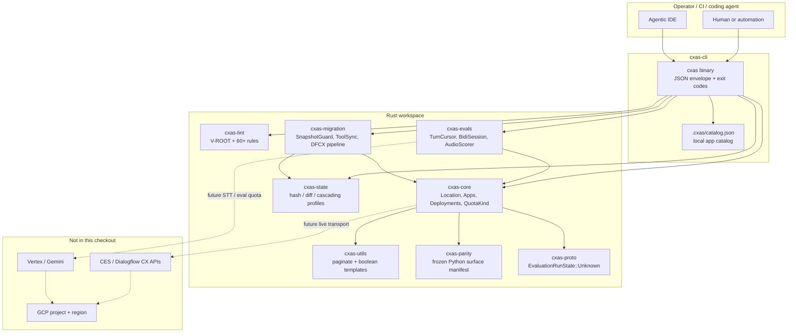

# cxas-harness

Rust rewrite of Google Cloud’s [`cxas-scrapi`](https://github.com/GoogleCloudPlatform/cxas-scrapi) — a CLI and library harness for CX Agent Studio (CES).

`cxas-harness` is built for **compile-time correctness**, **mandatory regional location**, **machine-first JSON CLI**, and a **modular crate workspace**. It implements the Superpowers Phase 0–5 plan set under `docs/superpowers/`.

```text
cargo test --workspace
cargo run -p cxas-cli -- --help
```

## What it is

| Layer | Role |
|---|---|
| `cxas` CLI | Machine-first `cxas` binary: JSON by default, `--no-input` on, stable exit codes |
| Local catalog | File-backed app/deployment store at `.cxas/catalog.json` (no implicit `"global"` location) |
| Workspace crates | Independent libraries for proto, core, evals, lint, migration, state, utils |
| Quality bar | Unit tests close the cataloged `cxas-scrapi` issue classes (enum drift, eval cursor, DTMF hang, lint root-agent, snapshot RAII, …) |

This checkout talks to a **local catalog and mocks**, not live CES/GCP. Location is never defaulted to `"global"`.

## Environment chart



**Data residency rule:** every CES-facing constructor takes a `Location`. Empty location is an error. The sentinel `__default_global__` is rejected. The literal `"global"` is allowed only when the caller passes it explicitly.

## Crate map

```text
cxas-harness/
  crates/
    cxas-parity      Phase 0  Frozen cxas-scrapi public surface (YAML)
    cxas-proto       Phase 0  EvaluationRunState with Unknown(i32)  (#284)
    cxas-core        Phase 1  Location, Apps export stream, QuotaKind, channels
    cxas-utils       Phase 1  Pagination + boolean env templates     (#256)
    cxas-state       Phase 1  Content-addressed hash / diff / profiles (#131, #270)
    cxas-evals       Phase 2  Simulation cursor, bidi DTMF, audio     (#355, #345, #136)
    cxas-lint        Phase 3  Rule registry, V-ROOT, welcome/depver   (#86, #397)
    cxas-migration   Phase 4  Snapshot RAII, tool sync, DFCX pipeline (#168, #394)
    cxas-cli         Phase 5  cxas binary, actions, docs, deny.toml   (#55, #46, #54)
  docs/superpowers/  Design specs + implementation plans
  parity/            Checked-in parity contract
  schema/            Lint required-field schema
  book/              mdBook sidebar: Docs / Examples / Agent Skills / Core SDK
```

## Requirements

- Rust 1.80+ (`rustc` / `cargo` on `PATH`, or `%USERPROFILE%\.cargo\bin` on Windows)
- Git
- Optional: `protoc` (without it, `cxas-proto` uses the hand-written `EvaluationRunState` wrapper)

## Build and test

```powershell
# Windows PowerShell if cargo is not on PATH
$env:Path = "$env:USERPROFILE\.cargo\bin;$env:Path"

cargo test --workspace
cargo build -p cxas-cli
```

```sh
# Unix
cargo test --workspace
cargo build -p cxas-cli
```

## Run the CLI

```powershell
$env:Path = "$env:USERPROFILE\.cargo\bin;$env:Path"

cargo run -p cxas-cli -- --help

cargo run -p cxas-cli -- init --app-dir .\my-app
cargo run -p cxas-cli -- lint --app-dir .\my-app
cargo run -p cxas-cli -- create --name demo --location us --project-id my-project
cargo run -p cxas-cli -- apps list --location us --project-id my-project
cargo run -p cxas-cli -- state --app-dir .\my-app --location us --project-id my-project
```

JSON is the default. Human output:

```powershell
cargo run -p cxas-cli -- --format human lint --app-dir .\my-app
```

Apps persist in `.cxas/catalog.json` (override with `CXAS_CATALOG`). Location is always required for CES-shaped commands.

### Exit codes

| Code | Meaning |
|---|---|
| 0 | Success |
| 1 | Runtime / CES / lint / eval / drift failure |
| 2 | Usage, missing location, TTY required, disabled feature |

Envelope:

```json
{ "ok": true,  "command": "lint", "data": { } }
{ "ok": false, "command": "pull", "error": { "code": "LOCATION_REQUIRED", "message": "..." } }
```

### Commands

| Command | What it does here |
|---|---|
| `init` / `local create` | Write `app.yaml` + root agent skeleton |
| `lint` | Structural lint (`V-ROOT` and 60+ rules) |
| `create` / `delete` / `apps list` / `apps get` | Local catalog apps |
| `push` / `branch` / `deploy` | Record import / branch / deployment locally |
| `pull` | Streamed export (mock transport; `--version-id` supported) |
| `state` / `diff` | Content hash and drift vs remote tree |
| `run` / `test-tools` / `test-callbacks` | Eval runners (fixture / mock) |
| `evals report` | Combined report including turn rows |
| `trace --raw` | Per-turn JSON |
| `actions init` | GitHub Actions workflow from `environment.json` |
| `migrate dfcx` | Non-interactive DFCX pipeline (no TUI by default) |
| `conversations` / `deployments` / `versions` / `insights` | Catalog / mock resources |
| `llm-lint` | Requires `--features llm` |
| `run-session` | Requires a TTY |

## Issue-driven quality bar

The rewrite is scored against Python `cxas-scrapi` parity **and** closing tests for the 25 open issues cataloged in `PRD.md.txt` / `dev.md.txt`. Mapping: `docs/superpowers/coverage-map.md`.

Representative closers already tested in-process:

| Issue | Closer |
|---|---|
| #284 | `EvaluationRunState::Unknown(i32)` never calls `.name` on a raw int |
| #401 | `Location` has no default; `"global"` only if explicit |
| #355 | `TurnCursor` advances past the first utterance |
| #345 | Bidi DTMF waits for the agent or times out |
| #86 | `V-ROOT` fails lint when `root_agent` is missing or dangling |
| #168 | `SnapshotGuard` deletes hillclimb snapshots on drop / panic / cancel |
| #256 | Environment templates render JSON booleans |

## Design docs

- Specs: `docs/superpowers/specs/`
- Plans: `docs/superpowers/plans/`
- Coverage map: `docs/superpowers/coverage-map.md`
- Product input: `PRD.md.txt`, `dev.md.txt`

## License

Apache-2.0. See crate `license` fields. This project is an independent rewrite; it is not an official Google product.
