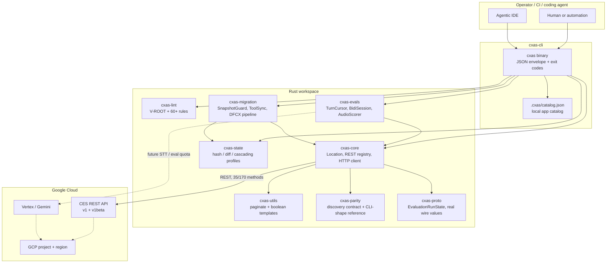

# cxas-harness

[](https://yash-kavaiya.github.io/cxas-harness/)
[](https://github.com/Yash-Kavaiya/cxas-harness)

**Documentation website:** <https://yash-kavaiya.github.io/cxas-harness/>

Rust rewrite of Google Cloud’s [`cxas-scrapi`](https://github.com/GoogleCloudPlatform/cxas-scrapi) — a CLI and library harness for CX Agent Studio (CES).

`cxas-harness` is built for **compile-time correctness**, **mandatory regional location**, **machine-first JSON CLI**, and a **modular crate workspace**. It implements the Superpowers Phase 0–5 plan set under `docs/superpowers/`.

```text
cargo test --workspace
cargo run -p cxas-cli -- --help
```

## What it is

| Layer | Role |
|---|---|
| `cxas` CLI | Machine-first `cxas` binary: JSON by default, `--no-input` on, stable exit codes |
| Local catalog | File-backed app/deployment store at `.cxas/catalog.json` (no implicit `"global"` location) |
| Workspace crates | Independent libraries for proto, core, evals, lint, migration, state, utils |
| Quality bar | Unit tests close the cataloged `cxas-scrapi` issue classes (enum drift, eval cursor, DTMF hang, lint root-agent, snapshot RAII, …) |
| Benchmark | Google's own CES discovery documents, vendored at a pinned revision — 66 methods in v1, 104 in v1beta |
| Gauntlet Loop | Builder/blind-critic loop under `gauntlet/`, scored against that benchmark |

`cxas-core` speaks the real CES REST surface: **35 of 170 methods** are declared and
verified against the vendored discovery documents, with an HTTP client behind the
`rest` feature. The CLI still reads and writes a local catalog at `.cxas/catalog.json`;
wiring the commands onto the live client is the next phase. Location is never defaulted
to `"global"` — every CES path template embeds `projects/*/locations/*`, so a resource
name cannot be built without one.

## Environment chart



**Data residency rule:** every CES-facing constructor takes a `Location`. Empty location is an error. The sentinel `__default_global__` is rejected. The literal `"global"` is allowed only when the caller passes it explicitly.

## Crate map

```text
cxas-harness/
  crates/
    cxas-parity      Phase 0  Python CLI-shape reference + discovery contract
    cxas-discovery   Phase 6  Parser over the vendored CES discovery documents
    cxas-proto       Phase 0  EvaluationRunState, real CES wire values  (#284)
    cxas-core        Phase 1  Location, REST method registry, HTTP client
    cxas-utils       Phase 1  Pagination + boolean env templates     (#256)
    cxas-state       Phase 1  Content-addressed hash / diff / profiles (#131, #270)
    cxas-evals       Phase 2  Simulation cursor, bidi DTMF, audio     (#355, #345, #136)
    cxas-lint        Phase 3  Rule registry, V-ROOT, welcome/depver   (#86, #397)
    cxas-migration   Phase 4  Snapshot RAII, tool sync, DFCX pipeline (#168, #394)
    cxas-cli         Phase 5  cxas binary, actions, docs, deny.toml   (#55, #46, #54)
  reference/ces/     Vendored CES discovery documents, pinned + sha256
  gauntlet/          Builder / blind-critic loop (repo tooling, not shipped)
  docs/superpowers/  Design specs + implementation plans
  parity/            Python CLI-shape reference
  schema/            Lint required-field schema
  book/              mdBook sidebar: Docs / Examples / Agent Skills / Core SDK
  docs-site/         Published documentation website (GitHub Pages)
```

## Documentation website

Full multi-page docs (getting started, architecture, every CLI command, crate SDK, lint/evals/migration, all 25 issue closers, and how the site is deployed):

**https://yash-kavaiya.github.io/cxas-harness/**

Source: [`docs-site/`](docs-site/). Preview locally with `python -m http.server` from that directory. The GitHub repository homepage field points at the same URL.

## Requirements

- Rust 1.80+ (`rustc` / `cargo` on `PATH`, or `%USERPROFILE%\.cargo\bin` on Windows)
- Git
- Optional: `protoc` (without it, `cxas-proto` uses the hand-written `EvaluationRunState` wrapper)

## Build and test

```powershell
# Windows PowerShell if cargo is not on PATH
$env:Path = "$env:USERPROFILE\.cargo\bin;$env:Path"

cargo test --workspace
cargo build -p cxas-cli
```

```sh
# Unix
cargo test --workspace
cargo build -p cxas-cli
```

## Run the CLI

```powershell
$env:Path = "$env:USERPROFILE\.cargo\bin;$env:Path"

cargo run -p cxas-cli -- --help

cargo run -p cxas-cli -- init --app-dir .\my-app
cargo run -p cxas-cli -- lint --app-dir .\my-app
cargo run -p cxas-cli -- create --name demo --location us --project-id my-project
cargo run -p cxas-cli -- apps list --location us --project-id my-project
cargo run -p cxas-cli -- state --app-dir .\my-app --location us --project-id my-project
```

JSON is the default. Human output:

```powershell
cargo run -p cxas-cli -- --format human lint --app-dir .\my-app
```

Apps persist in `.cxas/catalog.json` (override with `CXAS_CATALOG`). Location is always required for CES-shaped commands.

### Exit codes

| Code | Meaning |
|---|---|
| 0 | Success |
| 1 | Runtime / CES / lint / eval / drift failure |
| 2 | Usage, missing location, TTY required, disabled feature |

Envelope:

```json
{ "ok": true,  "command": "lint", "data": { } }
{ "ok": false, "command": "pull", "error": { "code": "LOCATION_REQUIRED", "message": "..." } }
```

### Commands

| Command | What it does here |
|---|---|
| `init` / `local create` | Write `app.yaml` + root agent skeleton |
| `lint` | Structural lint (`V-ROOT` and 60+ rules) |
| `create` / `delete` / `apps list` / `apps get` | Local catalog apps |
| `push` / `branch` / `deploy` | Record import / branch / deployment locally |
| `pull` | Streamed export (mock transport; `--version-id` supported) |
| `state` / `diff` | Content hash and drift vs remote tree |
| `run` / `test-tools` / `test-callbacks` | Eval runners (fixture / mock) |
| `evals report` | Combined report including turn rows |
| `trace --raw` | Per-turn JSON |
| `actions init` | GitHub Actions workflow from `environment.json` |
| `migrate dfcx` | Non-interactive DFCX pipeline (no TUI by default) |
| `conversations` / `deployments` / `versions` / `insights` | Catalog / mock resources |
| `llm-lint` | Requires `--features llm` |
| `run-session` | Requires a TTY |

## Issue-driven quality bar

The rewrite is scored against Python `cxas-scrapi` parity **and** closing tests for the 25 open issues cataloged in `PRD.md.txt` / `dev.md.txt`. Mapping: `docs/superpowers/coverage-map.md`.

Representative closers already tested in-process:

| Issue | Closer |
|---|---|
| #284 | `EvaluationRunState` matches the CES wire enum exactly, verified against discovery |
| #401 | `Location` has no default; `"global"` only if explicit |
| #355 | `TurnCursor` advances past the first utterance |
| #345 | Bidi DTMF waits for the agent or times out |
| #86 | `V-ROOT` fails lint when `root_agent` is missing or dangling |
| #168 | `SnapshotGuard` deletes hillclimb snapshots on drop / panic / cancel |
| #256 | Environment templates render JSON booleans |

## Talking to CES

`cxas-core` declares each CES method as data, and `cxas-parity` asserts every entry
resolves in the vendored discovery document with the same verb and path template. A
typo in a path fails the test suite instead of a live request.

```text
CES-COVERAGE v1=23/66 v1beta=12/104 total=35/170
```

Evaluations are registered only against `v1beta`, because the `v1` surface exposes no
evaluation resources at all — a test enforces that, since declaring one on `v1` would
build a URL that can only ever 404.

Request construction is pure and always compiled: URL expansion, query encoding, header
assembly, and status-to-error mapping are testable without a network or a credential.
Only the send step needs the `rest` feature:

```sh
cargo test -p cxas-core --features rest
```

```rust
use cxas_core::{method_spec, ApiVersion, AppRef, CesHttpClient, Location};

let app = AppRef::new("my-project", Location::new("us-central1")?, "my-app")?;
let client = CesHttpClient::new(oauth_token)?;
let spec = method_spec("ces.projects.locations.apps.get", ApiVersion::V1).unwrap();
let json = client.call(spec, &params, &query, None).await?;
```

Path templates use RFC 6570 reserved expansion: `{+name}` keeps the slashes in
`projects/p/locations/us/apps/a` structural, while still encoding characters that could
smuggle a query string into the URL. Getting that backwards yields a 404 that no type in
the workspace would catch, so both directions are tested.

## Benchmark and the Gauntlet Loop

The API benchmark is Google's own CES discovery documents, vendored under
[`reference/ces/`](reference/ces/) at a pinned revision: **66 methods in v1, 104
in v1beta**. [`crates/cxas-discovery`](crates/cxas-discovery) parses them, and
`cxas-parity` asserts that every enum variant this workspace declares matches
its CES wire spelling exactly.

That contract found a real defect on its first run. `EvaluationRunState`
declared `PENDING`/`SUCCEEDED`/`FAILED` where CES declares
`QUEUED`/`COMPLETED`/`ERROR` — the test closing the enum-drift bug (#284) had
itself drifted, invisibly to 78 passing tests. The previous parity contract
could not have caught it: it asserted that a checked-in YAML contained strings
that same YAML declared.

[`gauntlet/`](gauntlet/) builds on that benchmark. Builder agents work per
crate, each paired with a blind critic that sees only test output, clippy
results, discovery coverage, and issue reproductions — never the source or the
builder's reasoning. Blindness is enforced by a test, not by instruction. See
[`gauntlet/README.md`](gauntlet/README.md).

## Design docs

- Specs: `docs/superpowers/specs/`
- Plans: `docs/superpowers/plans/`
- Coverage map: `docs/superpowers/coverage-map.md`
- Product input: `PRD.md.txt`, `dev.md.txt`

## License

Apache-2.0. See crate `license` fields. This project is an independent rewrite; it is not an official Google product.
